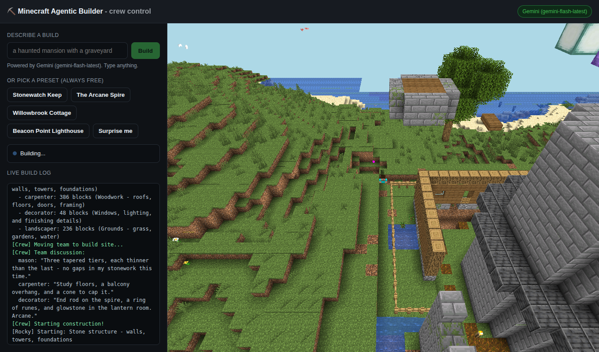

<div align="center">

<a href="https://noblerworks.com/"></a>

### Built by [Nobler Works](https://noblerworks.com/)

We build AI agents, real-time dashboards, and custom software for clients who need to move fast and see clearly.<br>
If you want something like Minecraft Agentic Builder built for your domain, [get in touch](https://noblerworks.com/).

[](https://noblerworks.com/)
[](https://x.com/Nobler_Works)
[](https://www.youtube.com/@NoblerWorks)
[](https://www.tiktok.com/@noblerworks)
[](https://www.threads.com/@noblerworks)

</div>

---

<div align="center">

# ⛏️ Minecraft Agentic Builder

**Watch a crew of AI agents design and build castles in Minecraft - live, in your browser.
You don't even need to own the game.**

[](https://nodejs.org)
[](https://www.minecraft.net)
[](#-pick-your-ai)
[](LICENSE)


*Rocky, Woody, Fancy, and Bloom building Stonewatch Keep (2,609 blocks) - recorded straight
from the built-in browser viewer at `http://localhost:3000`. No Minecraft client involved.*

</div>

---

Type one line - *"a haunted mansion with a graveyard"* - and an AI turns it into a build
plan. Then four Mineflayer bots with distinct personalities split the work, place every
block, and trash-talk each other in chat while they do it. Point any browser at
`localhost:3000` and watch it happen.

```
you:   npm run play
crew:  Rocky (mason)  Woody (carpenter)  Fancy (decorator)  Bloom (landscaper)
you:   open http://localhost:3000 and watch them build
```

## ⚡ Quick start

You need **[Docker](https://www.docker.com/products/docker-desktop/)** and **Node.js 18+**.
That's it - no Minecraft account, no API key.

```bash
npm install
npm run play
```

`npm run play` does everything: starts a local Minecraft server (first run downloads it,
~1 min), shows you a menu, and the crew builds while you watch at
**http://localhost:3000** (drag to orbit, scroll to zoom).

```
  Curated builds (no AI needed - always free):
    1. Stonewatch Keep - a moated castle with round towers
    2. The Arcane Spire - a tapered wizard tower that glows
    3. Willowbrook Cottage - a timber cottage with a garden
    4. Beacon Point Lighthouse - a striped tower on a rocky isle
    5. Surprise me (random)

  ...or type your OWN idea and the AI will design it:
```

Every preset is procedurally generated - sizes, materials, and details are randomized, so
no two castles come out the same. Add an API key ([Gemini is free](#-pick-your-ai)) and the
same menu accepts any prompt you can dream up.

> **New here? [docs/SETUP.md](docs/SETUP.md) is the copy-paste walkthrough** - including
> step-by-step instructions for getting a key from every provider.

## 🧠 Pick your AI

The crew doesn't care where the plan comes from. You need **none** of these to start:

| Backend | Key | Cost | Notes |
|---------|-----|------|-------|
| **Built-in library** | none | Free | The default. Curated procedural builds, randomized each run. |
| **Google Gemini** | `GEMINI_API_KEY` | **Free tier** | Recommended for custom prompts. [Get a key](https://aistudio.google.com/apikey). |
| **Anthropic Claude** | `ANTHROPIC_API_KEY` | Paid | Highest-quality builds. [Get a key](https://console.anthropic.com/). |
| **OpenAI** | `OPENAI_API_KEY` | Paid | [Get a key](https://platform.openai.com/). |
| **Ollama** | none | Free | Fully local/offline. Needs a real GPU. `LLM_PROVIDER=ollama`. |

Set one key in `.env` (`npm run setup` creates it) and it's auto-detected. Better models
design better builds. Force a backend with `LLM_PROVIDER=gemini|claude|openai|ollama|library`.
Per-provider signup walkthroughs: [docs/SETUP.md](docs/SETUP.md#choosing-an-ai-backend-for-custom-builds).

## 🤖 Meet the crew

Four bots, one shared plan, real teamwork (and real bickering in chat):

| Bot | Role | Handles |
|-----|------|---------|
| **Rocky** | Mason | Stone, bricks, foundations, towers |
| **Woody** | Carpenter | Wood, framing, floors, roofs |
| **Fancy** | Decorator | Windows, lighting, interior details |
| **Bloom** | Landscaper | Gardens, moats, trees, grounds |

```bash
npm run play "wizard tower"                 # parallel - all four at once (more chaotic, more fun)
npm run play "wizard tower" --sequential    # one bot at a time (cleaner time-lapse)
npm run play "wizard tower" --no-viewer     # skip the browser viewer (watch in-game)
```

## 🖥️ Two ways to watch

| | Browser viewer (default) | In the Minecraft game |
|---|---|---|
| **Own Minecraft?** | Not needed | Java Edition required |
| **How** | Open `http://localhost:3000` | Direct Connect to `localhost` (1.20.1) |
| **Best for** | Anyone, demos, recording clips | Full fidelity, walking around, building alongside |

Both work at the same time - they're views of the same world. The browser viewer is
[prismarine-viewer](https://github.com/PrismarineJS/prismarine-viewer); it needs the native
`canvas` module, which installs automatically on most platforms. If it can't build on
yours, **nothing breaks** - the bots still build and you watch in-game instead
([fix instructions](docs/SETUP.md#browser-viewer)).

## 🎛️ Web control panel

The plain viewer is read-only. `npm run web` gives you a **browser control panel** instead:
type a prompt (or pick a preset), hit Build, and watch the crew build it - viewer embedded
right on the page, with a live, color-coded build log streaming in.

```bash
npm run web        # opens http://localhost:8080 in your browser automatically
```

It opens your default browser once the crew is ready (works on Linux, macOS, Windows, and WSL).
Pass `--no-open` (or set `NO_OPEN=1`) to skip that, e.g. on a headless box.



The crew connects **once** and stays online, so each prompt builds immediately (no reconnect).
Builds land on a fresh patch of ground, so you end up with a little gallery - and a
**Clear ground** button bulldozes the whole gallery back to a clean slate in about a second.
Pick a **scene** (Plains, Beach, Desert, Mountains, Snowy, Jungle, Cherry Grove) and you get a
clean, pretty, flat starting point - a solid themed platform (encased so no caves or ravines
show underneath) with a tasteful backdrop (a calm beach pool, cherry trees, stone peaks...) and
a flat centre to build on. Each scene lives on its own permanent plot, so it's **built once and
then cached** - the first visit constructs it (~10s), every visit after is a ~3s teleport, even
across restarts (the world is saved to disk). The embedded viewer re-frames automatically. With an AI key the prompt box is live; with no key the preset
chips still work (they're free). Change the port with `WEB_PORT`. Everything lives on that one
URL - the 3D view is served same-origin at `/viewer/`, so there's no second port to open.

## 🎬 Making content with it

This project exists to produce great footage. A recipe that works:

1. `npm run play`, pick something dramatic (or prompt *"an epic dragon statue"*).
2. Record the browser viewer (or your Minecraft client) while the crew works.
3. Speed it up 4-8x, end on a slow orbit of the finished build.

Hooks that land: *"I let 4 AI agents loose in Minecraft"*, *"AI construction crew builds my
dumbest ideas"*, *"these bots argue while building a castle"*. Multiple bots in frame +
chat bubbles + a zoom-out reveal is the formula. The clip at the top of this README was
captured exactly this way.

## ⚙️ Configuration

All via `.env` (copy from `.env.example`, or let `npm run setup` do it):

| Variable | Default | What it does |
|----------|---------|--------------|
| `LLM_PROVIDER` | auto | `library` / `gemini` / `claude` / `openai` / `ollama` |
| `GEMINI_API_KEY` | - | Gemini key (free tier) for custom builds |
| `ANTHROPIC_API_KEY` | - | Claude key for custom builds |
| `OPENAI_API_KEY` | - | OpenAI key for custom builds |
| `LIBRARY_BUILD` | random | Pin a preset: `castle` / `wizardTower` / `cottage` / `lighthouse` |
| `MC_HOST` / `MC_PORT` | `localhost` / `25565` | Where the Minecraft server is |
| `MC_USERNAME` | `BuilderBot` | Single-agent bot name (re-op after changing: `npm run ops -- Name`) |
| `VIEWER_PORT` | `3000` | Browser viewer port |
| `VIEWER` | on | Set `off` to disable the browser viewer |

## 🔧 All the commands

```bash
npm run play             # THE command: server up + menu + crew build
npm run play "a castle"  # skip the menu, build this (AI with a key, closest preset without)
npm run web              # browser control panel at http://localhost:8080 (prompt + watch)

npm run demo "a hut"     # single bot instead of the crew
npm start                # interactive CLI - type prompts one after another; !build/!stop from in-game chat
npm run offline          # no Docker, no key - prints a sample plan

npm run server           # start the Minecraft server (plain docker, no compose needed)
npm run server:stop      # stop it (world kept) - server:reset wipes, server:logs tails
npm run replay           # crew builds a library preset (no key; assumes server up)
npm run e2e              # end-to-end smoke test (no key)
npm run setup            # onboarding: creates .env, checks Node/Docker/server
npm run ops              # regenerate docker/ops.json (bot operator list)
```

## 🏗️ How it works

```
prompt ─▶ Coordinator ─▶ Gemini / Claude / OpenAI / Ollama ─▶ build plan (JSON: blocks + chat)
                          └▶ or the built-in library (no key)
                                        │
                                        ▼
                 4 workers place blocks via /setblock, narrating in chat
                                        │
                 bot connection ──▶ prismarine-viewer ──▶ your browser
```

```
src/
  coordinator.js  plans + splits work across the crew (any provider, or the library)
  providers.js    LLM abstraction: claude/gemini/openai/ollama, auto-detect, library fallback
  library/        procedural presets (castle / wizard tower / cottage / lighthouse)
  crew.js         multi-agent orchestration        worker.js   one bot + personality
  agent.js        single-agent planning            builder.js  block placement
  viewer.js       browser viewer w/ graceful fallback
  bot.js          Mineflayer connection            preflight.js friendly env checks
  e2e-test.js     no-key smoke test                crew-replay.js  no-key crew build
scripts/
  play.js         `npm run play`                   server.js   Docker server (no compose)
  setup.js        `npm run setup` onboarding       gen-ops.js  offline-UUID op list
```

More depth: [CLAUDE.md](CLAUDE.md) (invariants + gotchas), [docs/SETUP.md](docs/SETUP.md) (setup + troubleshooting).

## ❓ FAQ

**Why do the bots need to be server operators?**
They build with `/setblock`, `/fill`, and `/tp`, which need op. On a fresh server, un-opped
bots connect and then silently place nothing - the #1 gotcha. The bundled server handles it
by mounting [`docker/ops.json`](docker/ops.json), which ops each bot by its **offline UUID**
(the normal `OPS` env var does an online account lookup that fails for offline usernames).
Custom bot name? `npm run ops -- YourBot`, then restart the server.

**Is `online-mode=false` safe?**
Yes, for this. It lets bots log in without paid Mojang accounts - that's why you don't need
to own Minecraft. It applies only to *your* server on `localhost`, a private sandbox. Don't
point these bots at public servers you don't control.

**Does my prompt leave my machine?**
Only if you set an API key - then just the prompt goes to your chosen provider. Everything
else (server, bots, viewer) is 100% local. No key = nothing leaves at all.

**The bots connected but nothing is appearing?**
Ops (above), or your server isn't 1.20.1, or command blocks are off. The bundled
`npm run server` gets all three right - see [troubleshooting](docs/SETUP.md#troubleshooting).

## 🤝 Contributing

PRs welcome - this is meant to be a fun, hackable starting point. Good first PRs: a new
library preset (see [`src/library/index.js`](src/library/index.js) - the primitives make it
easy), a new personality, a new provider. [MIT licensed](LICENSE).
