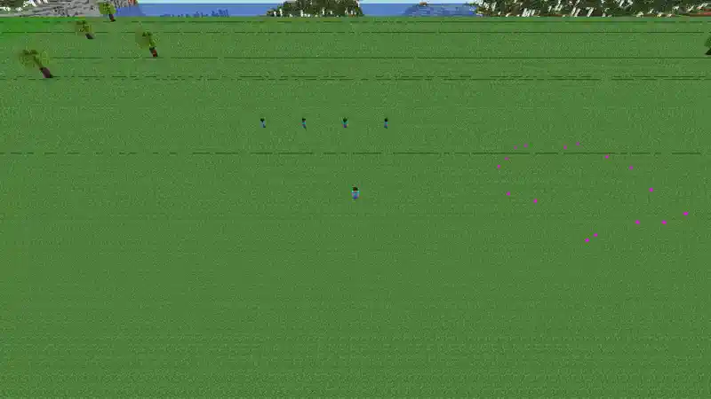

<div align="center">

<a href="https://noblerworks.com/"></a>

### Built by [Nobler Works](https://noblerworks.com/)

We build AI agents, real-time dashboards, and custom software for clients who need to move fast and see clearly.<br>
If you want something like Minecraft Agentic Builder built for your domain, [get in touch](https://noblerworks.com/).

[](https://noblerworks.com/)
[](https://x.com/Nobler_Works)
[](https://www.youtube.com/@NoblerWorks)
[](https://www.tiktok.com/@noblerworks)
[](https://www.threads.com/@noblerworks)

</div>

---

<div align="center">

# ⛏️ Minecraft Agentic Builder

**Watch a crew of AI agents design and build castles in Minecraft - live, in your browser.
You don't even need to own the game.**

[](https://nodejs.org)
[](https://www.minecraft.net)
[](#-pick-your-ai)
[](LICENSE)



*Rocky, Woody, Fancy, and Bloom building Stonewatch Keep (3,130 blocks, every one verified
in-world) on the Cherry Grove scene - recorded straight from the built-in browser viewer with
`npm run record`. No Minecraft client involved.*

</div>

---

Type one line - *"a haunted mansion with a graveyard"* - and an AI turns it into a build
plan. Then four Mineflayer bots with distinct personalities split the work, walk the site,
place every block, and trash-talk each other in chat while they do it. It all streams to a
web page, so anyone with a browser can watch.

```
you:   npm run web
crew:  Rocky (mason)  Woody (carpenter)  Fancy (decorator)  Bloom (landscaper)
you:   type an idea, click the ground where you want it, watch it go up
```

## ⚡ Quick start

You need **[Docker](https://www.docker.com/products/docker-desktop/)** and **Node.js 18+**.
That's it - no Minecraft account, no API key.

```bash
npm install
npm run web      # everything in one browser tab (recommended)
```

That's the whole setup. `npm run web` starts a local Minecraft server (first run downloads
it, ~1 min), hires the crew, and **opens your browser on http://localhost:8080** - on a
loading screen that shows each startup step ticking over, so you're never staring at a
blank page wondering if it hung.

Prefer the terminal? `npm run play` gives you the same builds from a menu, with a read-only
3D view at `http://localhost:3000`.

| | `npm run web` | `npm run play` |
|---|---|---|
| **Where** | One browser tab, `:8080` | Terminal menu + viewer at `:3000` |
| **You get** | Prompt box, presets, scenes, click-to-place, live log, 3D view | A menu, then watch |
| **Crew** | Connects once, stays online - builds start instantly | Reconnects each run |

## 🎛️ The control panel


Everything lives on that one URL - the 3D view is served same-origin at `/viewer/`, so
there's no second port to open and nothing to wire up.

**Type an idea, or pick a preset.** The nine curated builds are always free (no API key,
no network), and each one is procedurally generated - sizes, materials and details are
randomized, so no two castles come out the same:

```
  Stonewatch Keep          a moated castle with round towers
  The Arcane Spire         a tapered wizard tower that glows
  Willowbrook Cottage      a timber cottage with a garden
  Beacon Point Lighthouse  a striped tower on a rocky isle
  Gristmill Rise           a working windmill over golden wheat
  The Vermilion Pagoda     three tiers of flaring red eaves
  The Wandering Gull       a galleon at anchor, sails set
  Temple of the Golden Sun a sandstone ziggurat in the dunes
  Celestia Observatory     a domed spire aimed at the stars
```

Add an API key ([Gemini is free](#-pick-your-ai)) and the prompt box goes live - any idea
you can describe.

**Pick a scene.** Plains, Beach, Desert, Mountains, Snowy, Jungle, or Cherry Grove. Each
one is *constructed*, not found: a clean flat platform, encased underneath so no caves or
ravines show through, painted with the right biome (grass colour and water colour are biome
tints, not block properties), and finished with a tasteful backdrop - cherry trees, snow-capped
peaks, cacti, a beach whose sand slopes down under the sea on every side rather than ending
in a cliff. Each scene gets its own permanent plot, so it's **built once and cached**: the
first visit constructs it (~10s), every visit after is a ~3s teleport - even across restarts,
because the world is saved to disk.

**Pick a spot.** Click the ground in the 3D view and the crew stakes out a glowing outline
of the build's footprint right there, instead of taking the next slot on the grid. (Under
the hood: the click is unprojected through the viewer's live camera and intersected with the
ground plane, so it works on whatever is on screen - no mesh picking.)

**Clear ground.** Bulldozes the build area back to flat, open ground in a few seconds -
whether those builds are from this session or one you left running last week. The scene's
trees and flowers sit outside the build area and stay put.

## 🧠 Pick your AI

The crew doesn't care where the plan comes from. You need **none** of these to start:

| Backend | Key | Cost | Notes |
|---------|-----|------|-------|
| **Built-in library** | none | Free | The default. Curated procedural builds, randomized each run. |
| **Google Gemini** | `GEMINI_API_KEY` | **Free tier** | Recommended for custom prompts. [Get a key](https://aistudio.google.com/apikey). |
| **Anthropic Claude** | `ANTHROPIC_API_KEY` | Paid | Highest-quality builds. [Get a key](https://console.anthropic.com/). |
| **OpenAI** | `OPENAI_API_KEY` | Paid | [Get a key](https://platform.openai.com/). |
| **Ollama** | none | Free | Fully local/offline. Needs a real GPU. `LLM_PROVIDER=ollama`. |

Set one key in `.env` (`npm run setup` creates it) and it's auto-detected. Better models
design better builds. Force a backend with `LLM_PROVIDER=gemini|claude|openai|ollama|library`.
Per-provider signup walkthroughs: [docs/SETUP.md](docs/SETUP.md#choosing-an-ai-backend-for-custom-builds).

## 🤖 Meet the crew

Four bots, one shared plan, real teamwork (and real bickering in chat):

| Bot | Role | Handles |
|-----|------|---------|
| **Rocky** | Mason | Stone, bricks, foundations, towers - and anything load-bearing |
| **Woody** | Carpenter | Wood, framing, floors, roofs |
| **Fancy** | Decorator | Windows, lighting, interior details |
| **Bloom** | Landscaper | Gardens, moats, trees, grounds |

There's a fifth bot you never see working: **Cam**, a spectator that stands still and does
nothing at all. The browser view is rendered from *its* copy of the world - see
[the camera bot](#the-camera-bot-is-not-a-gimmick) below.

```bash
npm run play "wizard tower"                 # parallel - all four at once (more chaotic, more fun)
npm run play "wizard tower" --sequential    # one bot at a time (cleaner time-lapse)
npm run play "wizard tower" --no-viewer     # skip the browser viewer (watch in-game)
```

## ✨ The details that took the longest

Most of the work in this repo isn't the AI - it's making the build *look and behave like
real construction* instead of blocks appearing out of order. Some of it is only visible
once you know to look:

**The crew works the site.** Generators emit blocks in loop order - a whole wall, then a
floor, then trim on the far side - so the bots used to spend the build teleporting back and
forth across the plot like a strobe light. Each role's block list is now sorted into layers
and walked nearest-neighbour, so a bot shuffles along the course it's laying. The castle
mason's travel dropped from **10,215 blocks to 2,817**. Layers stay bottom-up, which isn't
cosmetic: it's what keeps a door's lower half before its upper, gravel off of air, and
support before the thing it supports.

**Builds check their own work.** Placed-block counters lie - a bot that quietly disconnects
mid-build keeps counting while its blocks go nowhere (that's how we got a cheerful "779
blocks!" on a house with no roof). After every build the crew re-reads the world and reports
exactly which blocks never landed. All nine presets verify at **0 missing**.

**The presets are simulated before they're trusted.** The crew builds in *parallel*, with the
four roles staggered a few seconds apart - so "the decorator carves a window into the mason's
wall" is really a race, and the mason kept winning it fifty seconds later, quietly filling the
window back in. `npm run test:presets` replays that exact schedule against vanilla physics
(neighbour-update pops, gravity, soil rules, door support) across seeded runs, and it found
**~145 distinct defects** no in-world check could see - stoned-over windows and arrow slits, a
lighthouse door that popped on 60 of 60 runs, roof stairs facing backwards. Every preset must
run clean before it ships - all nine do, across hundreds of seeded runs each.

**The world is pacified first.** Idle bots keep chunks loaded, so the game keeps spawning
mobs there - and with mob griefing on, endermen lift grass and sand straight out of the
surface, leaving pits that look like caves in the viewer (247 of them, on one plot). The
crew sets the world to peaceful, permanent noon, no griefing, no fire, no weather.

<a name="the-camera-bot-is-not-a-gimmick"></a>
**The camera bot is not a gimmick.** The browser renders the world as *a bot* sees it, and
the viewer re-sends chunks every time that bot crosses a chunk boundary. Race that against
its own async mesher and finished geometry gets thrown away and never re-queued - the section
freezes on screen. Bound to a worker, one cottage build did **132 chunk reloads** and the
browser showed a roofless house with a beam hanging in mid-air, while the actual world was
perfectly fine. The view is now bound to a bot that never moves during a build: **0 reloads.**

## 🖥️ Two ways to watch

| | Browser (default) | In the Minecraft game |
|---|---|---|
| **Own Minecraft?** | Not needed | Java Edition required |
| **How** | `npm run web` → `:8080`, or `npm run play` → `:3000` | Direct Connect to `localhost` (1.20.1) |
| **Best for** | Anyone, demos, recording clips | Full fidelity, walking around, building alongside |

Both work at the same time - they're views of the same world. The browser viewer is
[prismarine-viewer](https://github.com/PrismarineJS/prismarine-viewer); it needs the native
`canvas` module, which installs automatically on most platforms. If it can't build on
yours, **nothing breaks** - the bots still build and you watch in-game instead
([fix instructions](docs/SETUP.md#browser-viewer)).

## 🎬 Making content with it

This project exists to produce great footage, so the clip at the top of this README is not a
hand-edit - it's a command:

```bash
npm run web                                              # in one terminal
npm run record                                           # in another
npm run record -- --preset=wizardTower --scene=snowy     # any preset, any scene
```

`npm run record` (`scripts/record-demo.mjs`) points a headless browser at the 3D view, frames
the shot, builds, and cuts a two-speed timelapse - the build races past, then a slow orbit
reveals the finished thing. It writes an `.mp4` master and the compressed animated `.webp` the
README embeds, both date-stamped. It needs `ffmpeg` and `npx playwright install chromium`; it
refuses to publish a clip of a build that didn't finish.

Hand-rolling it instead? Pick a scene that suits the build (Cherry Grove and Snowy shoot well),
prompt something dramatic - *"an epic dragon statue"* - and record the browser view. The camera
holds still during a build, so the footage is steady enough to speed up hard.

Hooks that land: *"I let 4 AI agents loose in Minecraft"*, *"AI construction crew builds my
dumbest ideas"*, *"these bots argue while building a castle"*. Multiple bots in frame +
chat bubbles + a zoom-out reveal is the formula. The clip at the top of this README was
captured exactly this way.

## ⚙️ Configuration

All via `.env` (copy from `.env.example`, or let `npm run setup` do it):

| Variable | Default | What it does |
|----------|---------|--------------|
| `LLM_PROVIDER` | auto | `library` / `gemini` / `claude` / `openai` / `ollama` |
| `GEMINI_API_KEY` | - | Gemini key (free tier) for custom builds |
| `ANTHROPIC_API_KEY` | - | Claude key for custom builds |
| `OPENAI_API_KEY` | - | OpenAI key for custom builds |
| `LIBRARY_BUILD` | random | Pin a preset: `castle` / `wizardTower` / `cottage` / `lighthouse` / `windmill` / `pagoda` / `ship` / `temple` / `observatory` |
| `MC_HOST` / `MC_PORT` | `localhost` / `25565` | Where the Minecraft server is |
| `MC_USERNAME` | `BuilderBot` | Single-agent bot name (re-op after changing: `npm run ops -- Name`) |
| `MC_VERSION` | `1.20.1` | Server **and** bot version. Leave it - the viewer supports 1.20.1 exactly. |
| `WEB_PORT` | `8080` | Control panel port (`npm run web`) |
| `VIEWER_PORT` | `3000` | Browser viewer port (auto-rolls if taken) |
| `VIEWER` | on | Set `off` to disable the browser viewer |
| `NO_OPEN` | - | `1` = don't auto-open a browser (headless boxes) |

Tuning knobs you probably don't need: `MC_VIEW_DISTANCE` (24 chunks - how far the *server*
sends), `VIEWER_DISTANCE` (16 chunks - how far the *browser* draws; both ceilings apply, and
the lower one wins), `MC_MEMORY`, `MC_TIMEOUT` (120s keepalive - a busy server starves its own
keepalives long before it stops working). Changing a server setting needs
`npm run server:recreate`, which rebuilds the container and keeps the world.

## 🔧 All the commands

```bash
npm run web              # browser control panel at http://localhost:8080 (prompt + watch)
npm run play             # terminal menu: server up + crew build, viewer at :3000
npm run play "a castle"  # skip the menu, build this (AI with a key, closest preset without)

npm run demo "a hut"     # single bot instead of the crew
npm start                # interactive CLI - prompt after prompt (also !build/!stop in chat)
npm run offline          # no Docker, no key - prints a sample plan

npm run server           # start the Minecraft server (plain docker, no compose needed)
npm run server:stop      # stop it (world kept)
npm run server:recreate  # rebuild the container, KEEP the world (how server settings take effect)
npm run server:reset     # wipe the world and start over    # server:logs tails
npm run setup            # onboarding: creates .env, checks Node/Docker/server
npm run ops              # regenerate docker/ops.json (bot operator list)
```

Tests - all of them run without an API key:

```bash
npm test                 # click-to-place raycast + preset integrity (no browser, no server)
npm run test:viewer      # does the BROWSER see what the crew built? (needs a server)
npm run replay           # crew builds a library preset from a cached plan (needs a server)
npm run e2e              # single-bot end-to-end smoke test (needs a server)

npm run record           # record the hero clip (needs a running `npm run web`, ffmpeg, playwright)
```

## 🏗️ How it works

```
prompt ─▶ Coordinator ─▶ Gemini / Claude / OpenAI / Ollama ─▶ build plan (JSON: blocks + chat)
                          └▶ or the built-in library (no key)
                                        │
                                        ▼
                 4 workers walk the site and place blocks, narrating in chat
                                        │
                 a 5th, stationary bot ──▶ prismarine-viewer ──▶ your browser
```

```
src/
  coordinator.js  plans + splits work across the crew (any provider, or the library)
  providers.js    LLM abstraction: claude/gemini/openai/ollama, auto-detect, library fallback
  library/        procedural presets (castle, wizard tower, cottage, lighthouse, windmill,
                  pagoda, ship, temple, observatory)
  crew.js         multi-agent orchestration        worker.js   one bot + personality + route
  agent.js        single-agent planning            builder.js  block placement
  viewer.js       browser viewer w/ graceful fallback
  camera.js       the stationary bot the view renders from
  world.js        pacifyWorld() - peaceful, no griefing, no weather, no command spam
  bot.js          Mineflayer connection            preflight.js friendly env checks
  e2e-test.js     no-key smoke test                crew-replay.js  no-key crew build
scripts/
  web.js          `npm run web` - control panel, viewer proxy, scenes, placement
  play.js         `npm run play`                   server.js   Docker server (no compose)
  setup.js        `npm run setup` onboarding       gen-ops.js  offline-UUID op list
test/             pick-ground / preset-audit / viewer-sync
```

More depth: [CLAUDE.md](CLAUDE.md) (invariants + hard-won gotchas), [docs/SETUP.md](docs/SETUP.md)
(setup + troubleshooting).

## ❓ FAQ

**Why do the bots need to be server operators?**
They build with `/setblock`, `/fill`, and `/tp`, which need op. On a fresh server, un-opped
bots connect and then silently place nothing - the #1 gotcha. The bundled server handles it
by mounting [`docker/ops.json`](docker/ops.json), which ops each bot by its **offline UUID**
(the normal `OPS` env var does an online account lookup that fails for offline usernames).
Custom bot name? `npm run ops -- YourBot`, then restart the server.

**Is `online-mode=false` safe?**
Yes, for this. It lets bots log in without paid Mojang accounts - that's why you don't need
to own Minecraft. It applies only to *your* server on `localhost`, a private sandbox. Don't
point these bots at public servers you don't control.

**Does my prompt leave my machine?**
Only if you set an API key - then just the prompt goes to your chosen provider. Everything
else (server, bots, viewer) is 100% local. No key = nothing leaves at all.

**Can I run two control panels at once?**
No - the bots have fixed usernames, so a second `npm run web` kicks the first one's crew off
the server. Stop the first one before starting another.

**The bots connected but nothing is appearing?**
Ops (above), or your server isn't 1.20.1, or command blocks are off. The bundled
`npm run server` gets all three right - see [troubleshooting](docs/SETUP.md#troubleshooting).

## 🤝 Contributing

PRs welcome - this is meant to be a fun, hackable starting point. Good first PRs: a new
library preset (see [`src/library/index.js`](src/library/index.js) - the primitives make it
easy), a new scene, a new personality, a new provider. [MIT licensed](LICENSE).
