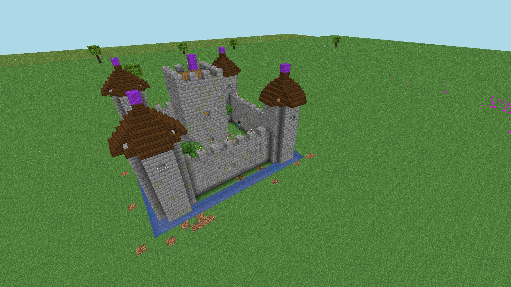
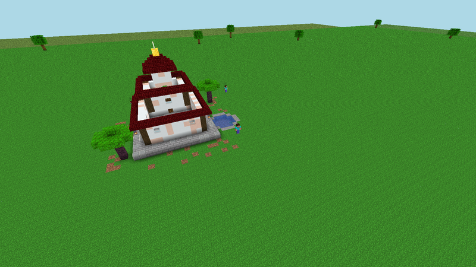
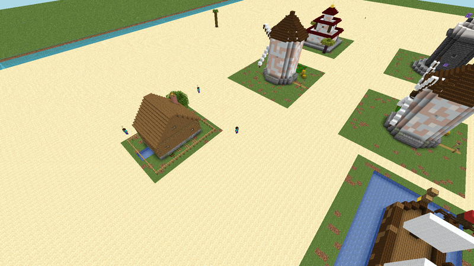
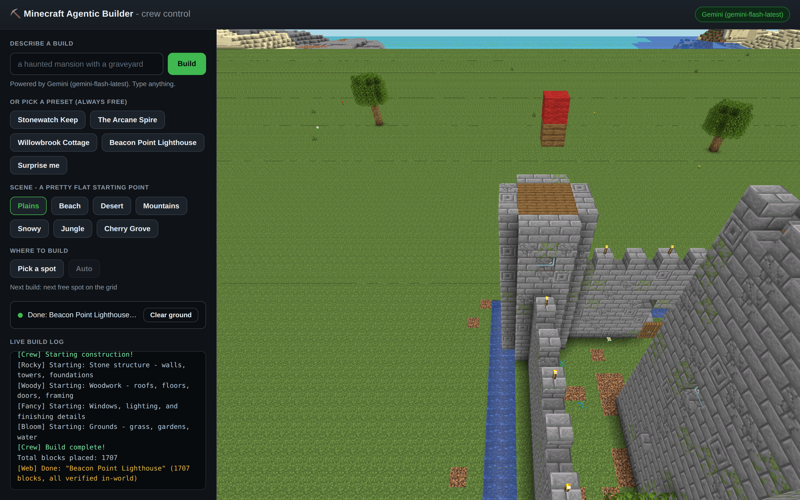

<div align="center">

<a href="https://noblerworks.com/"></a>

### Built by [Nobler Works](https://noblerworks.com/)

We build AI agents, real-time dashboards, and custom software for clients who need to move fast and see clearly.<br>
If you want something like Minecraft Agentic Builder built for your domain, [get in touch](https://noblerworks.com/).

[](https://noblerworks.com/)
[](https://x.com/Nobler_Works)
[](https://www.youtube.com/@NoblerWorks)
[](https://www.tiktok.com/@noblerworks)
[](https://www.threads.com/@noblerworks)

</div>

---

<div align="center">

# ⛏️ Minecraft Agentic Builder

**Watch a crew of AI agents design and build castles in Minecraft - live, in your browser.
You don't even need to own the game.**

[](https://github.com/NoblerWorks-HQ/minecraft-agentic/actions/workflows/ci.yml)
[](https://nodejs.org)
[](https://www.minecraft.net)
[](#-pick-your-ai)
[](LICENSE)



*Stonewatch Keep (2,559 blocks, every one verified in-world) on the Cherry Grove scene, minutes
after Rocky, Woody, Fancy, and Bloom finished it - a straight screenshot of the built-in
browser viewer. No Minecraft client involved.*

<table>
  <tr>
    <td></td>
    <td></td>
  </tr>
  <tr>
    <td align="center"><em>The Vermilion Pagoda, Jungle scene</em></td>
    <td align="center"><em>One beach plot, six builds later</em></td>
  </tr>
</table>

</div>

---

Type one line - *"a haunted mansion with a graveyard"* - and an AI turns it into a build
plan. Then four Mineflayer bots with distinct personalities split the work, walk the site,
place every block, and trash-talk each other in chat while they do it. It all streams to a
web page, so anyone with a browser can watch.

```
you:   npm run web
crew:  Rocky (mason)  Woody (carpenter)  Fancy (decorator)  Bloom (landscaper)
you:   type an idea, click the ground where you want it, watch it go up
```

## ⚡ Quick start

You need **[Docker](https://www.docker.com/products/docker-desktop/)** and **Node.js 20+**.
That's it - no Minecraft account, no API key.

```bash
npm install
npm run web      # everything in one browser tab (recommended)
```

That's the whole setup. `npm run web` starts a local Minecraft server (first run downloads
it, ~1 min), hires the crew, and **opens your browser on http://localhost:8080** - on a
loading screen that shows each startup step ticking over, so you're never staring at a
blank page wondering if it hung.

Prefer the terminal? `npm run play` gives you the same builds from a menu, with a read-only
3D view at `http://localhost:3000`.

| | `npm run web` | `npm run play` |
|---|---|---|
| **Where** | One browser tab, `:8080` | Terminal menu + viewer at `:3000` |
| **You get** | Prompt box, presets, scenes, click-to-place, live log, 3D view | A menu, then watch |
| **Crew** | Connects once, stays online - builds start instantly | Reconnects each run |

## 🎛️ The control panel



Everything lives on that one URL - the 3D view is served same-origin at `/viewer/`, so
there's no second port to open and nothing to wire up.

**Type an idea, or pick a preset.** The thirteen curated builds are always free (no API key,
no network), and each one is procedurally generated - sizes, materials and details are
randomized, so no two castles come out the same:

```
  Stonewatch Keep          a moated castle with round towers
  The Arcane Spire         a tapered wizard tower that glows
  Willowbrook Cottage      a timber cottage with a garden
  Beacon Point Lighthouse  a striped tower on a rocky isle
  Gristmill Rise           a working windmill over golden wheat
  The Vermilion Pagoda     three tiers of flaring red eaves
  The Wandering Gull       a galleon at anchor, sails set
  Temple of the Golden Sun a sandstone ziggurat in the dunes
  Celestia Observatory     a domed spire aimed at the stars
  Toadstool Hollow         a spotted mushroom-cap cottage that glows
  The Old Oak Hideout      a stilted treehouse in a giant canopy
  The Skylark              a hot-air balloon straining at its mooring
  Pioneer Pad              a rocket on its gantry, counting down
```

Add an API key ([Gemini is free](#-pick-your-ai)) and the prompt box goes live - any idea
you can describe.

**Pick a scene.** Plains, Beach, Desert, Mountains, Snowy, Jungle, or Cherry Grove. Each
one is *constructed*, not found: a clean flat platform, encased underneath so no caves or
ravines show through, painted with the right biome (grass colour and water colour are biome
tints, not block properties), and finished with a tasteful backdrop - cherry trees, snow-capped
peaks, cacti, a beach whose sand slopes down under the sea on every side rather than ending
in a cliff. Each scene gets its own permanent plot, so it's **built once and cached**: the
first visit constructs it (~10s), every visit after is a ~3s teleport - even across restarts,
because the world is saved to disk.

**Pick a spot.** Click the ground in the 3D view and the crew stakes out a glowing outline
of the build's footprint right there, instead of taking the next slot on the grid. (Under
the hood: the click is unprojected through the viewer's live camera and intersected with the
ground plane, so it works on whatever is on screen - no mesh picking.)

**Clear ground.** Bulldozes the build area back to flat, open ground in a few seconds -
whether those builds are from this session or one you left running last week. The scene's
trees and flowers sit outside the build area and stay put.

## 🧠 Pick your AI

The crew doesn't care where the plan comes from. You need **none** of these to start:

| Backend | Key | Cost | Notes |
|---------|-----|------|-------|
| **Built-in library** | none | Free | The default. Curated procedural builds, randomized each run. |
| **Google Gemini** | `GEMINI_API_KEY` | **Free tier** | Recommended for custom prompts. [Get a key](https://aistudio.google.com/apikey). |
| **Anthropic Claude** | `ANTHROPIC_API_KEY` | Paid | Highest-quality builds. [Get a key](https://console.anthropic.com/). |
| **OpenAI** | `OPENAI_API_KEY` | Paid | [Get a key](https://platform.openai.com/). |
| **Ollama** | none | Free | Fully local/offline. Needs a real GPU. `LLM_PROVIDER=ollama`. |

Set one key in `.env` (`npm run setup` creates it) and it's auto-detected. Better models
design better builds. Force a backend with `LLM_PROVIDER=gemini|claude|openai|ollama|library`.
Per-provider signup walkthroughs: [docs/SETUP.md](docs/SETUP.md#choosing-an-ai-backend-for-custom-builds).

> [!NOTE]
> Gemini is the most battle-tested live path (it's what this project is developed against,
> because it's free). The Claude and OpenAI paths are pinned by the test suite but have seen
> less live use - if one misbehaves for you, an issue is very welcome.

## 🧱 The AI designs in *ops*, not in blocks

For a long time the AI builds were noticeably worse than the bundled presets, and it was
tempting to blame the model. That was wrong. **The presets weren't better because a human
designed them - they were better because a human got to use primitives.**

A preset says `walls(...)` and gets four hundred gap-free blocks. The model was being asked for
that same wall as a JSON array with one object per block - `{"x":12,"y":7,"z":3,"type":"stone_bricks"}`,
about 11 tokens each. A 900-block build is then ~10k tokens of pure mechanical typing, and the
castle (3,338 blocks) is ~38k, which no output budget can buy. So the model did what anyone would
when told to enumerate thousands of tedious items: it cut corners. It returned **74 blocks with
holes in the walls**, and our own critic scored it **3/10** and was right.

So the model got the same vocabulary the presets have. [`src/ops.js`](src/ops.js) gives it a
dozen shapes - `walls`, `floor`, `cyl`, `disc`, `ring`, `cone`, `box`, `door`, `window`, `punch`,
`scatter`, `put` - each one line, each expanding to hundreds of blocks. Same prompt, measured:

| | blocks placed | critic score | missing |
|---|---|---|---|
| Block-by-block JSON | 74 | 3/10 | - |
| **Build ops** | **2,773** | **10/10** | **0** |

The ~28x compression is not really the point, though. The point is that **the old mistakes became
impossible.** A `walls` op is gap-free by construction. A `door` op always places both halves. A
`cone` op orients its own stair shingles. Every rule this crew learned the hard way used to be
*requested in prose* and then reproduced by hand, correctly, hundreds of times in a row - now it's
enforced once, in code.

The best example is windows. Glazing used to be two ops that had to agree: punch a hole in the
wall, then put glass in it. The model got the two coordinate sets subtly out of step, and a build
the critic happily scored 10/10 turned out to have **panes of glass floating in mid-air outside the
tower**. So `window` now carves *and* glazes in one move, and only glazes where a wall was really
removed - a window aimed at thin air is a no-op instead of a floating cube. **If a rule needs two
ops to agree, make it one op.**

Every op is untrusted input, so `expandOps` is the only door: it clamps coordinates to the plot,
refuses a runaway op outright, caps the total, and **validates every block name against the real
1.20.1 registry** - repairing near-misses (`stone_brick` → `stone_bricks`) and dropping the rest.
A hallucinated block name is the quietest failure in the project: `/setblock` discards it without
a word, leaving holes that nothing in the log explains.

Two details keep this honest. The op reference in the prompt is **generated from the op table**,
so the prompt can't describe an op that doesn't exist or miss one that does. And the worked example
the model sees on every request ([`src/plans/reference-ops.json`](src/plans/reference-ops.json)) is
audited on the same physics simulator as the presets - writing it flushed out two real bugs
before any model ever saw it.

## 🤖 Meet the crew

Four bots, one shared plan, real teamwork (and real bickering in chat):

| Bot | Role | Handles |
|-----|------|---------|
| **Rocky** | Mason | Stone, bricks, foundations, towers - and anything load-bearing |
| **Woody** | Carpenter | Wood, framing, floors, roofs |
| **Fancy** | Decorator | Windows, lighting, interior details |
| **Bloom** | Landscaper | Gardens, moats, trees, grounds |

There's a fifth bot you never see working: **Cam**, a spectator that stands still and does
nothing at all. The browser view is rendered from *its* copy of the world - see
[the camera bot](#the-camera-bot-is-not-a-gimmick) below.

```bash
npm run play "wizard tower"                 # parallel - all four at once (more chaotic, more fun)
npm run play "wizard tower" --sequential    # one bot at a time (cleaner time-lapse)
npm run play "wizard tower" --no-viewer     # skip the browser viewer (watch in-game)
```

The crew is **data, not code** - one JSON file per role in [`src/profiles/`](src/profiles/), and
both the bot and the AI's prompt are generated from it. Add a fifth builder by adding a fifth
file. (Idea borrowed from [mindcraft](https://github.com/mindcraft-bots/mindcraft) - see
[prior art](#-prior-art--inspiration).)

## 🔁 The crew checks its own work

When the last block lands, the build isn't finished - it's *submitted*. Two passes then ask two
different questions, because they catch completely different failures.

**"Did the world accept it?"** - the game is the judge, and it's free, so it always runs. The
crew re-reads the world and finds every block that isn't there, then re-places it. Blocks that
*still* won't stay aren't dropped commands, they're illegal ones - a torch on air, a door with no
floor, gravel over water - so with an AI key set, the model is shown each failure *with the reason
the game refused it* ("the block below is air") and patches the design. The patch is applied to
the plan, not just the world.

**"Is it any good?"** - a vision model is the judge, so it's opt-in (tick **Critique it** in the
panel, or `CRITIC=on`). A headless browser photographs the finished build from three angles, and
the model gets the pictures **next to its own blueprint** - the plan drawn as one ASCII floor map
per layer. That pairing is the whole trick: given only the plan it re-reads its own homework and
says it looks fine, and given only a photo it can describe the flaw beautifully but can't tell you
*where* it is. Together it hands back a patch in real coordinates, and a verdict that reads like:

> **6/10** - A squat stone box with a pitched roof; it reads as a barn, not a mansion.
> - the north face has no windows at all
> - the roofline is flat and reads as unfinished
> - nothing lights the entrance

Then it fixes what it found. This costs a model call, which is why it's a toggle and not a default.

## ✨ The details that took the longest

Most of the work in this repo isn't the AI - it's making the build *look and behave like
real construction* instead of blocks appearing out of order. Some of it is only visible
once you know to look:

**The crew works the site.** Generators emit blocks in loop order - a whole wall, then a
floor, then trim on the far side - so the bots used to spend the build teleporting back and
forth across the plot like a strobe light. Each role's block list is now sorted into layers
and walked nearest-neighbour, so a bot shuffles along the course it's laying. The castle
mason's travel dropped from **10,215 blocks to 2,817**. Layers stay bottom-up, which isn't
cosmetic: it's what keeps a door's lower half before its upper, gravel off of air, and
support before the thing it supports.

**Builds check their own work.** Placed-block counters lie - a bot that quietly disconnects
mid-build keeps counting while its blocks go nowhere (that's how we got a cheerful "779
blocks!" on a house with no roof). After every build the crew re-reads the world, finds exactly
which blocks never landed, and [puts them back](#-the-crew-checks-its-own-work). All thirteen
presets verify at **0 missing**.

**The presets are simulated before they're trusted.** The crew builds in *parallel*, with the
four roles staggered a few seconds apart - so "the decorator carves a window into the mason's
wall" is really a race, and the mason kept winning it fifty seconds later, quietly filling the
window back in. `npm run test:presets` replays that exact schedule against vanilla physics
(neighbour-update pops, gravity, soil rules, door support) across seeded runs, and it found
**~145 distinct defects** no in-world check could see - stoned-over windows and arrow slits, a
lighthouse door that popped on 60 of 60 runs, roof stairs facing backwards. Every preset must
run clean before it ships - all thirteen do, across hundreds of seeded runs each.

**The commands that succeed by doing nothing.** Minecraft's `/fill` refuses any region over
32,768 blocks - and refuses it in total silence: the command goes out, the server drops it, and
nothing anywhere says so. The crew's own "let me clear the area first!" was a single `/fill` over
the whole build, which is fine for every preset (the castle is the biggest at 20,808) and quietly
did **nothing at all** for a full-height AI build at 122,112. We proved it by marking both corners
of such a region: after the old command, both markers were still standing. There's now one
splitter ([`src/fill.js`](src/fill.js)) that every clear goes through. Same class of bug as the
block names, the disconnected bot, and the placed-block counter - the failure mode this codebase
keeps having to design against is *the thing that looks like it worked.*

**The world is pacified first.** Idle bots keep chunks loaded, so the game keeps spawning
mobs there - and with mob griefing on, endermen lift grass and sand straight out of the
surface, leaving pits that look like caves in the viewer (247 of them, on one plot). The
crew sets the world to peaceful, permanent noon, no griefing, no fire, no weather.

<a name="the-camera-bot-is-not-a-gimmick"></a>
**The camera bot is not a gimmick.** The browser renders the world as *a bot* sees it, and
the viewer re-sends chunks every time that bot crosses a chunk boundary. Race that against
its own async mesher and finished geometry gets thrown away and never re-queued - the section
freezes on screen. Bound to a worker, one cottage build did **132 chunk reloads** and the
browser showed a roofless house with a beam hanging in mid-air, while the actual world was
perfectly fine. The view is now bound to a bot that never moves during a build: **0 reloads.**

## 🖥️ Two ways to watch

| | Browser (default) | In the Minecraft game |
|---|---|---|
| **Own Minecraft?** | Not needed | Java Edition required |
| **How** | `npm run web` → `:8080`, or `npm run play` → `:3000` | Direct Connect to `localhost` (1.20.1) |
| **Best for** | Anyone, demos, recording clips | Full fidelity, walking around, building alongside |

Both work at the same time - they're views of the same world. The browser viewer is
[prismarine-viewer](https://github.com/PrismarineJS/prismarine-viewer); it needs the native
`canvas` module, which installs automatically on most platforms. If it can't build on
yours, **nothing breaks** - the bots still build and you watch in-game instead
([fix instructions](docs/SETUP.md#browser-viewer)).

## 🎬 Making content with it

This project exists to produce great footage. The screenshots at the top of this README are
straight captures of the built-in browser viewer; for moving pictures there's a command:

```bash
npm run web                                              # in one terminal
npm run record                                           # in another
npm run record -- --preset=wizardTower --scene=snowy     # any preset, any scene
```

`npm run record` (`scripts/record-demo.mjs`) points a headless browser at the 3D view, frames
the shot, builds, and cuts a two-speed timelapse - the build races past, then a slow orbit
reveals the finished thing. It writes an `.mp4` master and a compressed animated `.webp`, both
date-stamped. It needs `ffmpeg` and `npx playwright install chromium`; it refuses to publish a
clip of a build that didn't finish. (Fair warning: the software-rendered headless capture plus
heavy `.webp` compression reads noticeably worse than the live viewer - for a README or a
thumbnail, a screenshot of the finished build is the better-looking artifact.)

Hand-rolling it instead? Pick a scene that suits the build (Cherry Grove and Snowy shoot well),
prompt something dramatic - *"an epic dragon statue"* - and record the browser view. The camera
holds still during a build, so the footage is steady enough to speed up hard.

Hooks that land: *"I let 4 AI agents loose in Minecraft"*, *"AI construction crew builds my
dumbest ideas"*, *"these bots argue while building a castle"*. Multiple bots in frame +
chat bubbles + a zoom-out reveal is the formula.

## ⚙️ Configuration

All via `.env` (copy from `.env.example`, or let `npm run setup` do it):

| Variable | Default | What it does |
|----------|---------|--------------|
| `LLM_PROVIDER` | auto | `library` / `gemini` / `claude` / `openai` / `ollama` |
| `GEMINI_API_KEY` | - | Gemini key (free tier) for custom builds |
| `ANTHROPIC_API_KEY` | - | Claude key for custom builds |
| `OPENAI_API_KEY` | - | OpenAI key for custom builds |
| `LIBRARY_BUILD` | random | Pin a preset: `castle` / `wizardTower` / `cottage` / `lighthouse` / `windmill` / `pagoda` / `ship` / `temple` / `observatory` |
| `MC_HOST` / `MC_PORT` | `localhost` / `25565` | Where the Minecraft server is |
| `MC_USERNAME` | `BuilderBot` | Single-agent bot name (re-op after changing: `npm run ops -- Name`) |
| `MC_VERSION` | `1.20.1` | Server **and** bot version. Leave it - the viewer supports 1.20.1 exactly. |
| `WEB_PORT` | `8080` | Control panel port (`npm run web`) |
| `VIEWER_PORT` | `3000` | Browser viewer port (auto-rolls if taken) |
| `VIEWER` | on | Set `off` to disable the browser viewer |
| `NO_OPEN` | - | `1` = don't auto-open a browser (headless boxes) |
| `CRITIC` | off | `on` = photograph every build and have a vision model critique and patch it. Costs a model call per build; needs Playwright (`npx playwright install chromium`). The panel's **Critique it** checkbox does the same thing per-build. |
| `REPAIR` | on | `off` = still re-place dropped blocks, but never ask the model to fix a design the game refuses |
| `FEWSHOT` | on | `off` = don't show the model a matching preset as a worked example (~5k tokens/build) |
| `PROFILES_DIR` | `src/profiles` | Point at another directory to run a different crew entirely |
| `OLLAMA_VISION_MODEL` | - | A multimodal local model (e.g. `llava`) - without it, Ollama can't run the critic |

Tuning knobs you probably don't need: `MC_VIEW_DISTANCE` (24 chunks - how far the *server*
sends), `VIEWER_DISTANCE` (16 chunks - how far the *browser* draws; both ceilings apply, and
the lower one wins), `MC_MEMORY`, `MC_TIMEOUT` (120s keepalive - a busy server starves its own
keepalives long before it stops working), `SHOT_SETTLE_MS` (how long the critic's browser waits
for chunks to stream in before it takes the picture). Changing a server setting needs
`npm run server:recreate`, which rebuilds the container and keeps the world.

## 🔧 All the commands

```bash
npm run web              # browser control panel at http://localhost:8080 (prompt + watch)
npm run play             # terminal menu: server up + crew build, viewer at :3000
npm run play "a castle"  # skip the menu, build this (AI with a key, closest preset without)

npm run demo "a hut"     # single bot instead of the crew
npm start                # interactive CLI - prompt after prompt (also !build/!stop in chat)
npm run offline          # no Docker, no key - prints a sample plan

npm run server           # start the Minecraft server (plain docker, no compose needed)
npm run server:stop      # stop it (world kept)
npm run server:recreate  # rebuild the container, KEEP the world (how server settings take effect)
npm run server:reset     # wipe the world and start over    # server:logs tails
npm run setup            # onboarding: creates .env, checks Node/Docker/server
npm run ops              # regenerate docker/ops.json (bot operator list)
```

Tests - all of them run without an API key:

```bash
npm test                 # everything below that needs no server, no browser, no key
npm run test:loops       #   the repair/critic loops, crew profiles, the blueprint format,
                         #   each provider's truncation handling, and the /fill splitter
npm run test:ops         #   build ops: clamping, block-name validation, runaway refusal
npm run test:presets     #   simulates every preset on the crew's real parallel schedule
npm run test:viewer      # does the BROWSER see what the crew built? (needs a server)
npm run replay           # crew builds a library preset from a cached plan (needs a server)
npm run e2e              # single-bot end-to-end smoke test (needs a server)

npm run record           # record the hero clip (needs a running `npm run web`, ffmpeg, playwright)
```

## 🏗️ How it works

```
prompt ─▶ Coordinator ─▶ Gemini / Claude / OpenAI / Ollama ─▶ BUILD OPS (JSON: shapes + chat)
             ▲            └▶ or the built-in library (no key)          │
             │                                                         ▼
   a matching preset,                              expandOps: clamp to the plot, cap the
   as a worked example                             total, check every block name ─▶ plan
                                                                       │
                                                                       ▼
                       4 workers walk the site and place blocks, narrating in chat
                                        │
                 a 5th, stationary bot ──▶ prismarine-viewer ──▶ your browser
                                        │
                                        ▼
                    REPAIR: what did the world refuse, and why? ──▶ patch
                    REVIEW: photograph it, show the model ────────▶ patch   (opt-in)
```

```
src/
  coordinator.js  plans + splits work across the crew (any provider, or the library)
  ops.js          THE BUILD OPS - the vocabulary the model designs in, and the only door
                  they come through (clamped, capped, block names checked)
  providers.js    LLM abstraction: claude/gemini/openai/ollama + vision, library fallback
  profiles/       the crew as data - one JSON file per role (name, rules, materials)
  profiles.js     feeds both the bots and the coordinator's prompt from those files
  library/        procedural presets (castle, wizard tower, cottage, lighthouse, windmill,
                  pagoda, ship, temple, observatory, mushroom house, treehouse, hot-air
                  balloon, rocket pad) + canvas.js, the shared primitives
  crew.js         multi-agent orchestration        worker.js   one bot + personality + route
  repair.js       re-place what the world refused, and ask the model why  (Voyager)
  critic.js       show the finished build to a vision model, patch it     (APT)
  shot.js         headless screenshots of the live viewer, for the critic
  digest.js       a plan as an ASCII floor map per layer - the blueprint the models read
  fill.js         /fill caps at 32,768 blocks and refuses more in SILENCE - one splitter,
                  used by everything that clears ground
  json.js         the one fence-tolerant JSON extractor for model replies
  agent.js        single-agent planning            builder.js  block placement
  viewer.js       browser viewer w/ graceful fallback
  viewer-hook.js  the only way to reach the viewer's camera from outside its bundle
  camera.js       the stationary bot the view renders from
  world.js        pacifyWorld() - peaceful, no griefing, no weather, no command spam
  bot.js          Mineflayer connection            preflight.js friendly env checks
  e2e-test.js     no-key smoke test                crew-replay.js  no-key crew build
scripts/
  web.js          `npm run web` - control panel, viewer proxy, scenes, placement
  play.js         `npm run play`                   server.js   Docker server (no compose)
  setup.js        `npm run setup` onboarding       gen-ops.js  offline-UUID op list
test/             pick-ground / agent-loops / ops / preset-audit / viewer-sync
```

More depth: [docs/ARCHITECTURE.md](docs/ARCHITECTURE.md) (how a prompt becomes a building),
[CLAUDE.md](CLAUDE.md) (invariants + hard-won gotchas), [docs/SETUP.md](docs/SETUP.md)
(setup + troubleshooting). Want to contribute? [CONTRIBUTING.md](CONTRIBUTING.md).

## ❓ FAQ

**Why do the bots need to be server operators?**
They build with `/setblock`, `/fill`, and `/tp`, which need op. On a fresh server, un-opped
bots connect and then silently place nothing - the #1 gotcha. The bundled server handles it
by mounting [`docker/ops.json`](docker/ops.json), which ops each bot by its **offline UUID**
(the normal `OPS` env var does an online account lookup that fails for offline usernames).
Custom bot name? `npm run ops -- YourBot`, then restart the server.

**Is `online-mode=false` safe?**
Yes, for this. It lets bots log in without paid Mojang accounts - that's why you don't need
to own Minecraft. It applies only to *your* server on `localhost`, a private sandbox. Don't
point these bots at public servers you don't control.

**Does my prompt leave my machine?**
Only if you set an API key - then just the prompt goes to your chosen provider. Everything
else (server, bots, viewer) is 100% local. No key = nothing leaves at all.

**Can I run two control panels at once?**
No - the bots have fixed usernames, so a second `npm run web` kicks the first one's crew off
the server. Stop the first one before starting another.

**The bots connected but nothing is appearing?**
Ops (above), or your server isn't 1.20.1, or command blocks are off. The bundled
`npm run server` gets all three right - see [troubleshooting](docs/SETUP.md#troubleshooting).

## 🙏 Prior art & inspiration

This project stands on a lot of other people's work. Three ideas in particular were taken
directly from other open-source Minecraft-agent projects, and it's worth saying exactly which:

| Project | What we took |
|---------|--------------|
| **[Voyager](https://github.com/MineDojo/Voyager)** (MineDojo) | The self-correction loop. Voyager's core insight isn't "write code", it's *write code, run it, read the environment's complaint, rewrite it*. We were already generating that complaint (a post-build scan for blocks that never landed) and throwing it away. [`src/repair.js`](src/repair.js) closes the loop: re-place what dropped, and feed what the game still refuses back to the model **with the reason it refused**. |
| **[APT](https://github.com/spearsheep/APT-Architectural-Planning-LLM-Agent)** (Architectural Planning LLM Agent) | The multimodal review. APT pairs an LLM's spatial reasoning with visual input and a reflection step rather than trusting its first plan. [`src/critic.js`](src/critic.js) shows the model photographs of the finished build alongside its own blueprint, and [`src/digest.js`](src/digest.js) is the blueprint format that makes the critique *actionable* instead of just poetic. |
| **[mindcraft](https://github.com/mindcraft-bots/mindcraft)** (kolbytn / mindcraft-bots) | Agents as JSON profiles, and per-request few-shot example selection. Our four roles were hardcoded in two places that had quietly drifted apart; they're now one file each in [`src/profiles/`](src/profiles/), and the coordinator picks a matching worked example from the preset library for every prompt (mindcraft does this with embeddings; we do it with word overlap over thirteen presets, which needs no extra dependency). |

Worth your time even though we didn't borrow code from them:
[Project Sid](https://github.com/altera-al/project-sid) (Altera) - 1000+ agents forming a
civilization, and the current high-water mark for what this genre can be;
[Steve](https://github.com/YuvDwi/Steve) - solves our "two roles race for one coordinate" problem
by deterministic spatial partitioning instead of by ownership rules;
[BuilderGPT](https://github.com/CyniaAI/BuilderGPT) - generates a `.schem` file rather than
driving a bot, which makes builds testable and shareable without a server;
[T2BM](https://arxiv.org/abs/2406.08751) - the text-to-building-in-Minecraft paper.

And of course [mineflayer](https://github.com/PrismarineJS/mineflayer) and
[prismarine-viewer](https://github.com/PrismarineJS/prismarine-viewer), without which none of
this exists.

## 🤝 Contributing

PRs welcome - this is meant to be a fun, hackable starting point. Good first PRs: a new
library preset (see [`src/library/index.js`](src/library/index.js) - the primitives make it
easy), a new scene, a new personality, a new provider. [MIT licensed](LICENSE).
